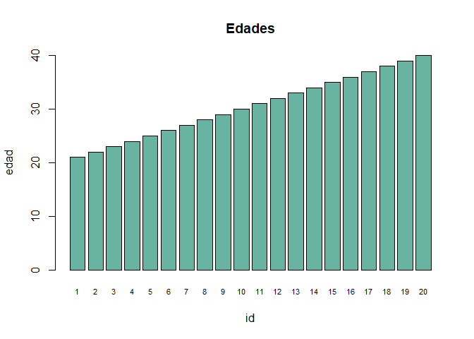
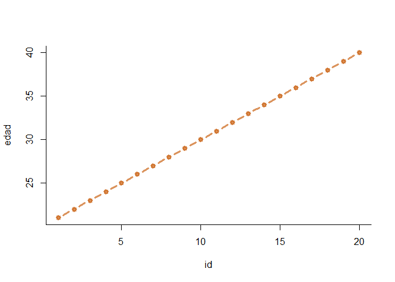
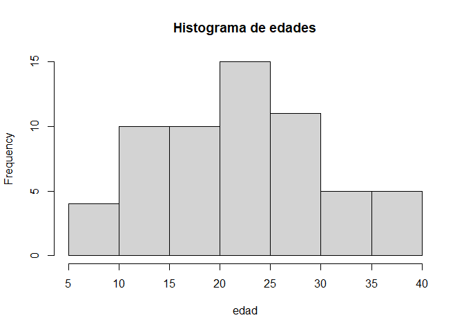
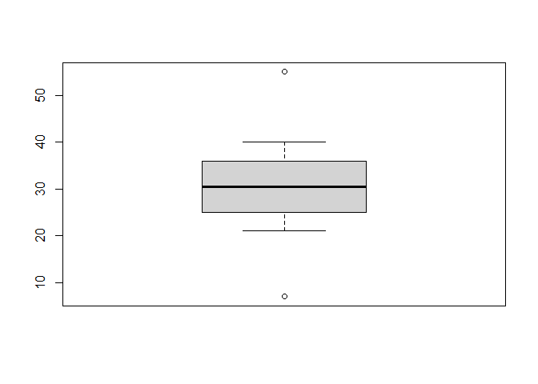

### Visualizar en R

Cargamos la base de datos ‘df.csv’ con la función read.csv() y le
asignamos (&lt;-) el nombre ‘df’ en el entorno de trabajo de R.

    df <- read.csv('https://observatoriodeconflictividad.org/df.csv')

Creamos un gráfico de barras con las edades

    barplot(height=df$edad, names=row.names(df), 
            col="#69b3a2",
            xlab="id", 
            ylab="edad", 
            main="Edades", 
            ylim=c(0,40),
            cex.names = 0.7
            )

Creamos un gráfico de líneas y puntos con las edades

    plot(df$edad~as.integer(row.names(df)), 
         bty="l", xlab="id", ylab="edad", 
         col=rgb(0.8,0.4,0.1,0.7),
         lwd=3, pch=19, type="b" )

Creamos un histograma con las edades

    hist(c(df$edad-12,df$edad,df$edad-12),
         xlab = 'edad', 
         main = 'Histograma de edades')

Creamos un diagramas de cajas y bigotes con las edades

    boxplot(c(7,df$edad,55), horizontal = FALSE)

###### Corra el código en Google Colab desde este [link](https://colab.research.google.com/drive/1gZqiwJjBrsxCsKLsEGyVT6raavukBIa2?usp=sharing "Google Colab").
